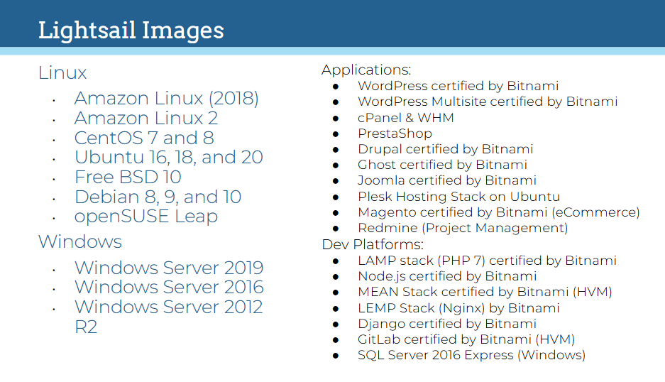

# Amazon Lightsail

## Lecture Notes: Lightsail

<figure><figcaption></figcaption></figure>

* Amazon Lightsail is the easiest way to get started with AWS for developers hwo need to build websites or web applications
* includes what you ned to launch a project quickly- instances (virtual private servers)
  * container services
  * managed databases
  * load balancers
  * SSD-based block storage
  * static IP addresses, DNS management of registered domains
  * resource snapshots (backups)
  * for a predictable monthly price
* Lightsail is for developers- don't have to spend as much time installing software or frameworks
  * Lightsail has images with base operating systems, development stacks like LAMP, LEMP, and SQL Server Express, and applications like WordPress, Drupal, and Magento

### Why Lightsail?

* simple web applications
  * easily deploy a web application with a few clicks
  * preconfigured development stacks like LAMP, Nginx, MEAN, and Node.js
* websites
  * can easily create a website with preconfig applications like WordPress, Magento, Plesk, and Joomla
* business software
  * can quickly launch line-of-business software like file storage and sharing, backups, financial and accounting software, etc.
* dev/test environments
  * can quickly spin up and destroy test environments and sandboxes outside of your prod environment
* designed for users who do not have significant technical skills or who simply require a low-cost, low-to-moderate performance virtual private server that they can deploy easily
* does not have the flexibility, control, or power of Amazon EC2
* offers simple load balancing, can connect to VPC and other AWS services
* easy to migrate to EC2
* can be cheaper than EC2
