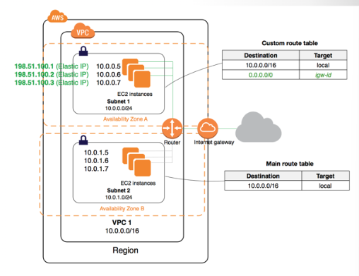

# Amazon VPC

## Lecture Notes: Amazon Virtual Private Cloud (VPC)

* Amazon VPC enables you to launch AWS resources into a virtual network that you've defined
* the networking layer for Amazon EC2
* closely resembles a traditional network, with the benefits of using the scalable infrastructure of AWS

### Key Components of VPC

* VPC: virtual network dedicated to your AWS account
* subnet: a range of IP addresses in your VPC
* route table: a set of rules, called routes, that are used to determine where network traffic is directed
* internet gateway: a gateway that you attach to your VPC to enable communication between resources in your VPC and the internet (like NAT)

### Default VPC

<figure><figcaption></figcaption></figure>

* all AWS accounts since 2013 come with a default VPC
  * also true for AWS Educate Accounts
* default VPC components
  * VPC with a size /16 IPv4 CIDR block (172.31.0.0/16) that provides up to 65535 private IPv4 addresses
  * size /20 default subnets in each Availability Zone that provides up to 4096 addresses per subnet
  * create an internet gateway and connect it to your default VPC
    * provides "static" NAT to instances
    * Amazon controls/configures
  * create a default security group and associate it with your default VPC
* you can use a default VPC like any other VPC:
  * add additional nondefault subnets
  * modify the main route tables
  * add additional route tables
  * associate additional security groups
  * update the rules of the default security groups
  * add AWS site-to-site VPN connections
  * add more IPv4 CIDR blocks

### Non-Default VPCs

<figure><figcaption></figcaption></figure>

* can create additional non-default VPCs with Amazon's VPC Console
  * there is a VPC Wizard that can help with configuration
* there is no charge for VPCs, but some services like VPNs cost money
* you can pick any private subnet you want and choose to add public IPs or internet gateways if you want internet access
* can enable internet access for an instance launched into a non-default subnet by attaching an internet gateway to its VPC and associating an Elastic IP address with the instance

### AWS Internet Gateway

<figure><figcaption></figcaption></figure>

* internet gateway (IGW) is like a border router
  * has an interface on your VPC private network
  * adding a default route (0.0.0.0) to the VPC routing table that points to the IGW IP allows the VPC to send all external traffic to the IGW

### Elastic IPs

* static, public IPv4 address
* you can associate an Elastic IP address with any instance or network interface in any VPC in your account
* with an Elastic IP address, you can mask the failure of an instance by rapidly remapping the address to another instance in your VPC
* using an Elastic IP address:&#x20;
  * allocate it for use in your account
  * associate it with an instance or network interface in your VPC
  * the Elastic IP remains allocated to your AWS account until you explicitly release it

#### Elastic IP Rules

* an Elastic IP can be associated with a single instance or network interface at a time
* you can move an Elastic IP address from one instance or network interface to another
* limited to 5 Elastic IPs per account
* no charge when Elastic IP is associated with a running instance
  * to ensure efficient use of Elastic IP addresses, there is a small hourly charge when they are reserved but not associated with a running instance

### VPC Definitions

* a subnet is a segment of the VPC IP address range where we can launch EC2 instances, RDS, and other AWS resources
  * subnets are further classified as public and private
  * public subnets hold resources that can be accessed from the Internet
  * common attributes for instances in public subnets to have are:
    * Elastic IP addresses or public IP addresses attached to the EC2 instance
    * IGW attached to the VPC
    * the subnet must have a route table entry with the destination as the IGW 0.0.0.0/0
  * private subnets are not accessible from the internet unless using NAT
* route tables
  * multiple subnets can be associated with a single route table
    * however, a single subnet cannot be associated with multiple route tables
  * route tables hold sets of rules (called routes) that are used to determine where the traffic is directed
  * every subnet in a VPC is linked to the route table
  * primary or main route tables are the ones that automatically come with your VPC
    * they control the routing for all subnets that are not explicitly associated with any other route table
  * the default route table cannot be deleted
  * custom route tables are the ones you create for your VPC and you can add routes as needed
  * custom route tables can be deleted when not required
* internet gateways (IGWs) are virtual routers that help a VPC connect to the internet
  * by default, instances that are launched in a VPC cannot communicate with the internet
    * to enable Internet access, the internet gateway needs to be attached to the VPC
  * public subnets get connected to the IGW through route tables to get accessed over the internet
  * internet gateways are horizontally scalable, highly available, and redundant
* NAT and ACLs
  * NAT devices can be either an instance or gateway residing in a public subnet (to which an EIP is assigned)
  * NAT devices help instances in private subnets interact with the internet
  * access control lists (ACLs) are an optional layer of security that act as a firewall for controlling network traffic in and out of the subnet
  * rules are defined with the ACL for allowing or denying network traffic either on ports or IP addresses
