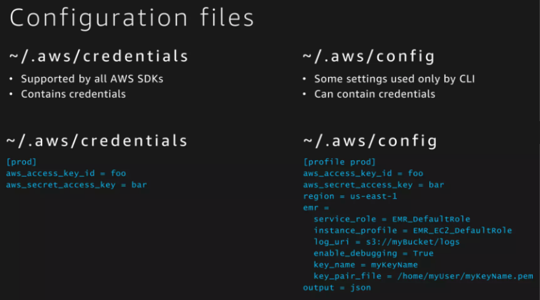
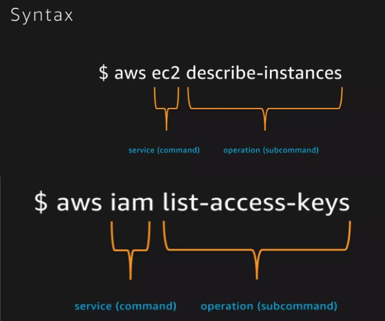
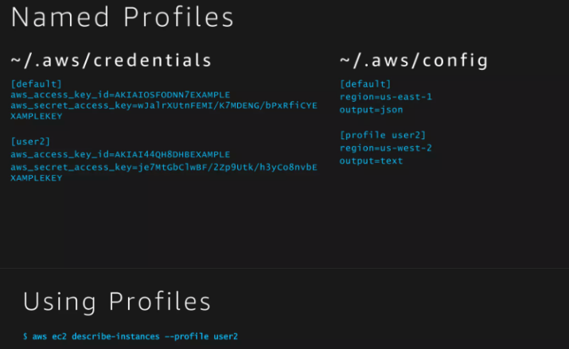
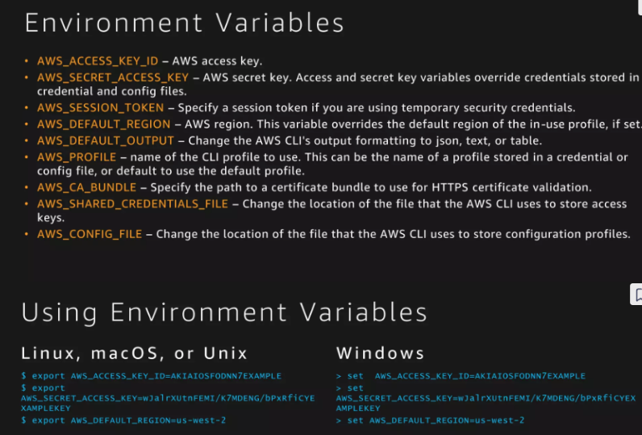
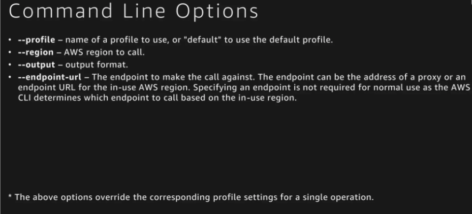

# AWS CLI

## Lecture Notes: AWS CLI

* AWS supports command line tools so that administrators do not have to use the AWS GUI console
  * helps automate/script procedures within AWS

### AWS CLI 2 Tools

* the CLI tools for AWS come as a free installable package from Amazon for Windows, OSX, and Linux
* the current version is known as CLI 2, which has most of the commands from the original CLI packages with modifications and new options
  * v2 came out in Feb 2020 and has substantial changes from v1
  * useful to specify version in search queries for syntax

### AWS CLI 2 Authentication

* as the CLI is using the command line to interact with services like EC2, you are not authenticating to the AWS console with a username/password
* AWS requires the following for the CLI:
  * AWS access key ID: identifier for the user
  * AWS secret access key: private key for the user
  * (optional) AWS session token: token value that is good for a limited period of time- needs to be updated for subsequent operations
* authentication values are typically found and/or created in the AWS console under IAM

### AWS CLI Config Files

<figure><figcaption></figcaption></figure>

* two config files need to be updated to use AWS CLI
* stored in %USERPROFILE% (Windows) or $HOME (Linux, OSX):
  * "configure"
    * stores default AWS region and preferred output
  * "credentials"
    * stores AWS key ID, secret key, and session token (if required)
    * must have permissions set to 400
* once config files are set, the commands starting with "aws" should work from the terminal
* files can be manually created/edited or the "aws configure" command can be used once CLI 2 is installed

### AWS CLI Session Token

* as an additional security measure, AWS through IAM settings may require a session token for CLI connections
* tokens have a timeout set, so if your AWS access key and secret key are compromised, they cannot be used without the current session token
* if session tokens are used, the .credentials file needs to include the current token

### Additional Information

<figure><figcaption><p>AWS CLI syntax</p></figcaption></figure>

<figure><figcaption><p>AWS CLI named profiles</p></figcaption></figure>

<figure><figcaption><p>AWS CLI environment variables</p></figcaption></figure>

<figure><figcaption><p>AWS CLI command line options</p></figcaption></figure>

## Lab Notes: AWS CLI

```
# after installing AWS CLI
aws configure
# region is us-east-1
ls -a
cd .aws
nano credentials
# paste in values from Learner Lab
chmod 400 credentials
aws ec2 run-instances --image-id [AMI ID] --count 1 --instance-type t2.micro --key-name [key pair name] --security-groups [group name] --region us-east-1
aws ec2 describe-instances
# can now SSH via public IP
aws ec2 terminate-instances --instance-ids [instance ID]
aws ec2 describe-instances --query  'Reservations[].Instances[].[InstanceId,PublicIpAddress]' --filters Name=instance-state-name,Values=running --output text
```

* can RDP into Windows instances by selecting instance -> Connect -> RDP client -> download file -> get password by uploading private key


