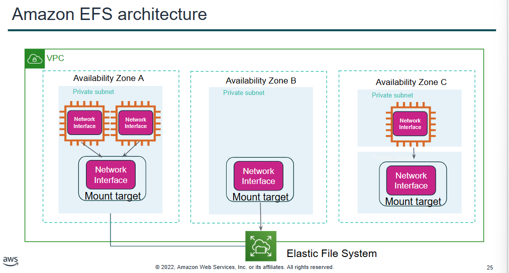
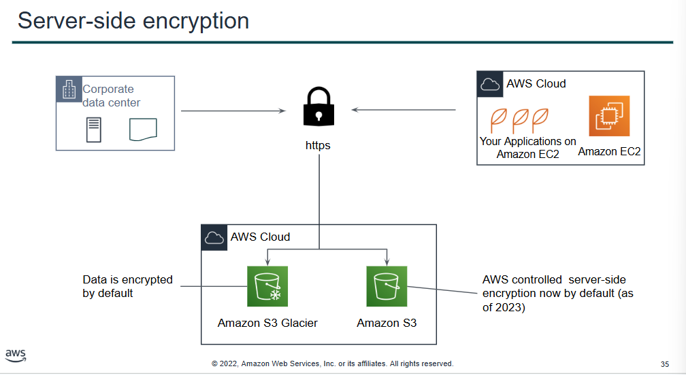

# AWS Storage and Encryption

## Lecture Notes: AWS Storage and Encryption

### AWS Storage: EBS

* block storage vs. object storage
  * block storage: change one block that contains the character
  * object storage: entire file must be updated
* Amazon Elastic Block Store
  * enables you to create individual storage volumes and attack them to an Amazon EC2 instance
    * EBS offers block-level storage
    * volumes are automatically replicated within its Availability Zone
    * can be backed up automatically to Amazon S3 through snapshots
    * uses include;
      * boot volumes and storage for Amazon EC2 instances
      * data storage with a file system
      * database hosts
      * enterprise applications
  * like a virtual hard disk in the drive
* volume types
  * SSDs:
    * general purpose
      * recommended for most workloads
        * system boot volumes
        * virtual desktops
        * low-latency interactive applications
        * development and test environments
      * max volume size 16 TiB
      * maximum IOPS/volume: 16000
      * maximum throughput/volume: 250 MiB/s
    * provisioned IOPS
      * critical business applications that require sustained IOPS performance (aka greater specs than the gen purpose SSD)
        * large database workloads
      * max volume size 16 TiB
      * maximum IOPS/volume: 64000
      * maximum throughput/volume: 1000 MiB/s
  * HDDs:
    * throughput-optimized
      * streaming workloads that require consistent, fast throughput at a low price
        * big data
        * data warehouses
        * log processing
        * cannot be a boot volume
      * max volume size 16 TiB
      * maximum IOPS/volume: 500
      * maximum throughput/volume: 500 MiB/s
    * cold
      * throughput-oriented storage for large volumes of data that are infrequently accessed
        * scenarios where the lowest storage cost is important
        * cannot be a boot volume
      * max volume size 16 TiB
      * maximum IOPS/volume: 250
      * maximum throughput/volume: 250 MiB/s
* Amazon EBS features
  * snapshots
    * point-in-time snapshots
    * recreate a new volume at any time
    * added cost of snapshots is per GB-month of data stored
  * encryption
    * encrypted Amazon EBS volumes
    * no additional cost
  * elasticity
    * increase capacity
    * change to different types
  * volumes:
    * persist independently from the instance
    * all volume types are charged by the amount that is provisioned per month
  * IOPS
    * general purpose SSD:
      * charged by the amount that you provision in GB per month until storage is released
    * magnetic:
      * charged by the number of requests to the volume
    * provisioned IOPS SSD:
      * charged by the amount that you provision in IOPS multiplied by the percentage of days that you provision for that month
  * data transfer:
    * inbound data transfer is free
    * outbound data transfer across regions incurs charges

### Amazon Storage: S3

* data is stored as objects in buckets
* virtually unlimited storage
  * single object is limited to 5TB
* designed for 11 9s of durability
* granular access to buckets and objects
* S3 storage classes
  * offers a range of object-level storage classes that are designed for different use cases
    * S3 standard
    * S3 intelligent-tiering
    * S3 standard-infrequent access
    * S3 one zone-infrequent access
    * S3 glacier
    * S3 glacier deep archive
* data is redundantly stored in the region
* designed for seamless scaling
* can access the data anywhere
* common use cases:
  * storing application assets
  * static web hosting
  * backup and disaster recovery
  * staging area for big data
* common scenarios:
  * backup and storage
  * application hosting
  * media hosting
  * software delivery
* pricing
  * pay only for what you use
    * GBs per month
    * transfer out to other regions
    * PUT, COPY, POST, LIST, and GET requests
  * do not pay for
    * transfers in
    * transfers out from S3 to CloudFront or EC2 in the same region
  * to estimate costs, consider:
    * storage class type
      * standard storage is designed for:
        * 11 9s of durability
        * four 9s of availability
      * S3 standard-infrequent access is designed for:
        * 11 9s of durability
        * three 9s of availability
    * amount of storage
      * the number and size of objects
    * requests
      * the number and type of requests
        * different rates for GET requests than other requests
    * data transfer
      * pricing is based on the amount of data that is transferred out of the S3 region

### Amazon Storage: Elastic File System

<figure><figcaption></figcaption></figure>

* Amazon EFS features
  * file storage in the AWS cloud
  * works well for big data and analytics, media processing workflows, content management, web serving, and home directories
  * petabyte-scale, low-latency file system
  * shared storage
  * elastic capacity
  * supports Network File System (NFS) versions 4.0 and 4.1
  * compatible with all Linux-based AMIs for Amazon EC2
* implementation
  * create your EC2 resources and launch your instance
  * create your EFS file system
  * create your mount targets in the appropriate subnets
  * connect your EC2 instances to the mount targets
  * verify the resources and protection of your AWS account
* resources
  * file system
    * mount target
      * subnet ID
      * security groups
      * one or more per file system
      * create in a VPC subnet
      * one per availability zone
      * must be in the same VPC
    * tags
      * key-value pairs

### Amazon Storage: S3 Glacier

* Glacier is a data archiving service that is designed for security, durability, and extremely low cost
  * designed to provide 11 9s of durability for objects
  * supports the encryption of data in transit and at rest through SSL or TLS
  * the Vault Lock feature enforces compliance through a policy
  * extremely low-cost design works well for long-term archiving
    * provides three options for access to archives- expedited, standard, and bulk
      * retrieval times range from a few minutes to several hours
* storage service for low-cost data archiving and long-term backup
* can configure lifecycle archiving of S3 content to S3 Glacier
* retrieval options:
  * standard: 3-5 hours
  * bulk: 5-12 hours
  * expedited: 1-5 minutes
* use cases:
  * media asset archiving
  * healthcare information archiving
  * regulatory and compliance archiving
  * scientific data archiving
  * digital preservation
  * magnetic tape replacement
* can use with RESTful web services, Java or .NET SDKs, or S3 with lifecycle policies
* lifecycle policies enable you to delete or move objects based on age
* storage comparison
  * S3
    * data volume: no limit
    * average latency: ms
    * item size: 5TB maximum
    * cost/GB per month: higher
    * billed requests: PUT, COPY, POST, LIST, GET
    * retrieval pricing: per request
  * S3 Glacier
    * data volume: no limit
    * average latency: minutes/hours
    * item size: 40 TB maximum
    * cost/GB per month: lower
    * billed requests: UPLOAD and retrieval
    * retrieval pricing: per request and per GB

### Amazon Encryption

<figure><figcaption></figcaption></figure>

* S3 Glacier:
  * controls access with IAM
  * encrypts your data with AES-256
  * manages your keys for you
* encryption of data at rest
  * encryption encodes data with a secret key, which makes it unreadable
    * only those who have the secret key can decode the data
    * AWS KMS can manage your secret keys
  * AWS supports encryption of data at rest
    * can encrypt data stored in any service supported by AWS KMS, including:
      * S3
      * EBS
      * EFS
      * RDS managed databases
* encryption of data in transit
  * TLS
    * AWS certificate manager provides a way to manage, deploy, and renew TLS or SSL certs
  * HTTPS creates a secure tunnel
    * TLS or SSL for the bidirectional exchange of data
  * AWS services support data in transit encryption
    * ex. EC2 -> EFS
* securing S3 buckets and objects
  * newly created S3 buckets and objects are private and protected by default
  * when uses cases require sharing data objects on S3:
    * it is essential to manage and control the data access
    * follow the principle of least privilege and consider using S3 encryption
  * tools and options for controlling access to S3 data include:
    * Amaozn S3 Block Public Access feature
    * IAM policies
    * bucket policies
    * access control lists
    * AWS Trusted Advisor bucket permission check

## Lab Notes: Server-Side Encryption

* creating an S3 bucket
  * Services -> S3 -> Create bucket -> name, SSE-S3 encryption -> create
    * can now upload files
* creating a customer managed key in KMS
  * Key Management Service -> Create a key -> Symmetric -> add alias -> add vocareum, voclabs, and vocareum-eventbridge roles in Key Administrative page -> add the same in Key Usage Permissions -> create
* using the key to protect a file in S3 bucket
  * navigate to S3 bucket -> Upload -> add file -> Properties -> Specify an encryption key -> override bucket settings, SSE-S3 (this uses the S3 master key)
  * can select SSE-KMS instead to pick the previously created key
