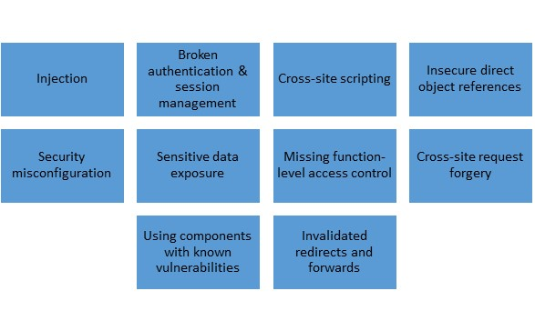

# Cloud Application and Network Security

## Lecture Notes: Cloud Application Security Risks

* cloud providers of all service models need to pay extra attention to certain aspects of their application services that could cause very significant problems for their customers if there are security issues:
  * APIs and web services need to be extensively hardened and assume attacks from both authenticated and authenticated adversaries
    * this includes using industry-standard authentication designed specifically for APIs
  * APIs should be monitored for abuse and unusual activity
  * the service should undergo extensive design and testing to prevent attacks or inappropriate/accidental cross-tenant access

### Assessing Common Vulnerabilities

<figure><figcaption></figcaption></figure>

* the most common software vulnerabilities are found in the OWASP top 10

### Cloud Specific Risks

* whether run in a platform as a service or infrastructure as a service deployment model, applications running in a cloud environment may enjoy the same security controls surrounding them as applications that run in a traditional data center environment
  * applications that run in a PaaS environment may need security controls baked into them
    * ex. encryption may need to be programmed into applications and logging may be difficult depending on what the cloud service provider can offer
  * application isolation also needs to be addressed- one application shouldn't be able to access another application on the platform unless it's allowed access through a control
* the Cloud Security Alliance's Top Threats Working Group has published the top nine cloud computing threats:

<figure><figcaption></figcaption></figure>

## Lecture Notes: Securing Network Configuration

<figure><figcaption></figcaption></figure>

* several technologies, protocols, and services are necessary to ensure a secure and reliable network is provided to the end user of close-based services
  * ex. TLS and IPSec can be used for securing communications to prevent eavesdropping
  * DNSSEC should be used to prevent DNS poisoning
    * DNSSEC is a suite of Internet Engineering Task Force (IETF) specifications for securing certain kinds of information provided by DNS as used on IP networks
* network isolation is a critical design concept for a secure network configuration in a cloud environment
* VLANs can improve network security in most environments
  * a VLAN is a set of workstations within a LAN that can communicate with each other as though they were on a single, isolated LAN
  * they are an IEEE standard networking scheme and specific tagging methods that allow routing of packets to only those ports that are part of the VLAN
  * the ability to isolate network traffic to certain machines or groups of machines via association with the VLAN allows for the opportunity to create secure pathing of data between endpoints
* TLS is a cryptographic protocol designed to provide communication security over a network
  * made up of two layers: TLS record protocol and TLS handshake protocol
* DNS is a hierarchical, distributed database that contains mappings of the DNS domain names to various types of data (ex. IP addresses)
  * DNSSEC is a suite of extensions that adds security to the DNS protocol by enabling DNS responses to be validated
  * provides origin authority, data integrity, and authenticated denial of existence
* IPSec is cryptographic security to protect communications over an IP network
  * IPSec includes protocols for establishing mutual authentication at the beginning of the session and negotiating cryptographic keys to be used during the session
  * IPSec supports network level peer authentication, data origin authentication, data integrity, encryption, and relay protection
