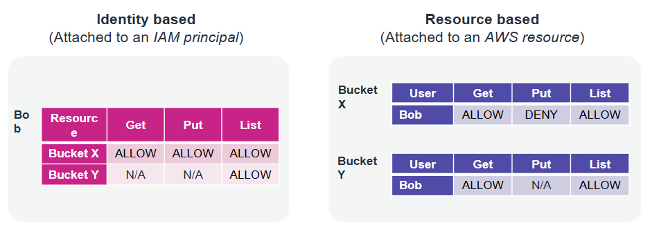

# Cloud Platform and Infrastructure Security

## Lecture Notes: Protecting Data in Your Application

### Data At Rest

* common scenarios:
  * information disclosure
  * data integrity compromise
  * accidental or malicious deletion
  * system, hardware, and software availability
* protecting data at rest means an extra layer of protection if your system is compromised
* data at rest in Amazon S3
  * private by default and requires AWS credentials for access
    * use bucket policies for granular access to objects
    * consider encrypting data at rest
  * can grant permissions based on identity or resource, as well as type of request (ex. GET is allowed but PUT and LIST are not)

<figure><figcaption></figcaption></figure>

### S3 Protection Features

* S3 Block Public Access
  * helps manage public access to Amazon S3 resources
  * four settings:
    * BlockPublicAcls: block public access granted by new ACLs
    * IgnorePublicAcls: block public access granted by any ACLs
    * BlockPublicPolicy: block public access granted by new public bucket policies
    * RestrictPublicBuckets: block public and cross-account access by any public bucket policies
* S3 Versioning
  * creates a new version with every upload
  * protects from unintended deletion
  * provides retrieval of deleted objects
  * can be used with lifecycle policies for cost savings
  * can't be turned off once enabled, only suspended
  * offers MFA delete for extra security
* S3 Object Lock
  * stores objects by using the write-once-read-many (WORM) model
  * works only in versioned buckets
  * provides the ability to manage object retention
  * provides two retention modes:
    * governance
      * can select which users have permissions
    * compliance
      * no users have permissions

### Protection Through Encryption

* client-side encryption
  * your application encrypts data before sending it to AWS
  * data is stored in its encrypted state
  * the keys and algorithms are known only to you
* server-side encryption
  * AWS encrypts data on your behalf after receiving it
  * the process is transparent to the user
* types of Amazon S3 server-side encryption
  * SSE-C
    * you retain control of the keys
    * S3 doesn't store the encryption keys that you provide
  * SSE-S3
    * AWS manages the keys
    * the encrypted data and keys are stored in separate hosts
  * SSE-KMS
    * AWS manages the keys
    * an envelope key is used for added protection
      * encrypting a key with another key
* AWS Key Management Service
  * provides the ability to create and manage cryptographic keys
  * uses hardware security modules (HSMs) to protect your keys
  * is integrated with other AWS services
  * provides the ability to set usage policies to determine which users can use keys

### Protect Data in Transit

* risks that data in transit is exposed to:
  * comms might go through public internet
  * accidental information disclosures
  * data integrity compromises
  * identity compromises
    * MITM attacks
    * identity spoofing
* protecting data in transit:
  * use SSL endpoints over TLS
  * use encryption
  * use Amazon Virtual Private Cloud endpoints to limit access to your bucket
* protecting remote connections to servers
  * RDP is typically used for Windows servers
    * RDP establishes an underlying SSL/TLS connection
    * for better security, issue a trusted X.509 certificate
    * don't use the default self-signed certificates
  * SSH is typically used for Linux servers
    * SSH establishes a secure communication channel
    * use tunneling to protect the application session in transit
    * don't allow the root user to use an SSH terminal
    * be sure that all users log in with an SSH key pair, then deactivate password authentication
* AWS Certificate Manager (ACM)
  * provides a single interface to manage both public and private certificates
  * makes it easy to deploy certificates
  * protects and stores private certificates
  * minimizes downtime and outages with automatic renewals

### Best Practices in Amazon S3

* presigned URLs
  * generate an S3 presigned URL and use it to upload files/objects
  * a presigned URL uses three parameters to limit user access
    * bucket: bucket that the object is in or will be in
    * key: name of the object
    * expires: amount of time that the URL is valid
* security considerations and best practices
  * consider encryption of data at rest, and enforce encryption of data in transit
  * ensure that your S3 buckets use the correct policies and are not publicly accessible
  * use the principle of least privilege
  * enable MFA delete for buckets
  * enforce encryption for each PUT request
  * use presigned URLs for applications that refer to Amazon S3 objects
  * to encrypt all objects, set default encryption on a bucket
  * if using S3 Object Lock, use the appropriate retention mode
  * use S3 Block Public Access
  * upload data to Amazon S3 over SFTP through AWS Transfer for SFTP
  * enable S3 Versioning

### Additional Data Protection Services

* AWS Secrets Manager
  * secure and scalable method for managing access to secrets
  * a way to meet regulatory and compliance requirements
  * rotates secrets safely without breaking applications
  * audits and monitors the lifecycle of secrets
  * helps you avoid putting secrets in code or config files
* Amazon Macie
  * recognizes sensitive data like PII, financial information, encryption keys, and credentials
  * allows for custom-defined data types
  * protects data stored in S3 by monitoring resource policies and ACLs
  * provides full API coverage for management
  * integrates with AWS Organizations
  * classify data and monitor its access permissions
    * scans and evaluates bucket objects for policy violations and sensitive data
    * generates findings in real time for:
      * buckets that are public
      * buckets that are not encrypted
      * buckets that are shared or replicated
