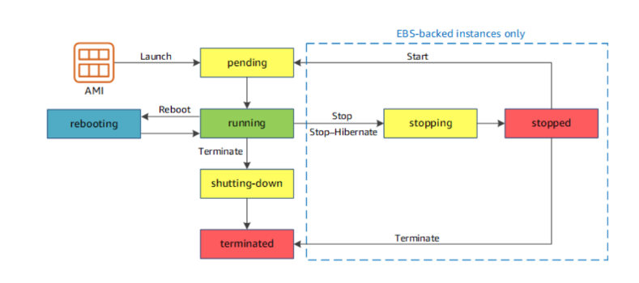
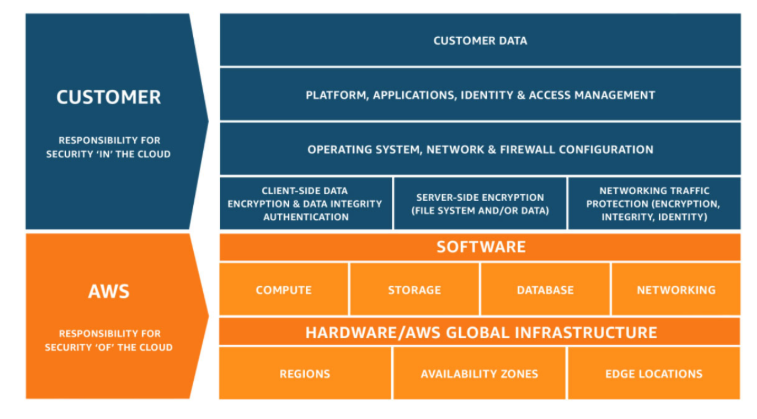

# Intro to AWS, Shared Responsibility, and IAM

## Lecture Notes: Intro to AWS

### Amazon EC2

* Amazon Elastic Compute Cloud allows customers to run virtual servers in the Amazon cloud and provides:
  * virtual computing environments, known as instances
  * preconfigured templates for your instances known as Amazon Machine Images (AMIs) that package the bits you need for your server (including the OS and additional software)
  * various configurations of CPU, memory, storage, and networking capacity for your instances, known as instance types
  * secure login information for your instances using key pairs (AWS stores the public key, and you store the private key in a secure place)

### Amazon EC2 Features

* multiple physical locations for your resources (like instances and Amazon EBS volumes) known as Regions and Availability Zones
* a firewall that enables you to specify the protocols, ports, and source IP ranges that can reach your instances using security groups
* static IPv4 addresses for dynamic cloud computing known as Elastic IP addresses
* virtual networks you can create that are logically isolated from the rest of the AWS cloud and that you can optionally connect to your own network, known as virtual private clouds (VPCs)
* storage for use by instances

### Instances and AMIs

* an AMI is a template that contains a software configuration
  * ex. an operating system, an application server, and applications
  * similar to a VMWare template
* from an AMI, you launch an instance, which is a copy of the AMI running as a virtual server on the cloud
  * can launch multiple instances of an AMI

### AMIs

* AWS publishes many AMIs that contain common software configurations
* in addition, members of the AWS developer community publish custom AMIs
* for example, if your application is a website or a web service, your AMI could include a web server, the associated static content, and the code for the dynamic pages

### Instances

* an instance is a virtual server in the cloud
  * its configuration at launch is a copy of the AMI specified when the instance is launched
* different types of instances can launch from a single AMI
  * an instance type essentially determines the hardware of the host computer used for your instance
  * each instance type offers different compute and memory capabilities

### Instance Types



### Instance Storage

* instances can use:
  * storage volumes for temporary data that's deleted when you stop or terminate your instance, known as instance store volumes
    * not very common anymore- can be faster and cheaper, but only used when you have large temp files for processing
  * persistent storage volumes for your data using Amazon Elastic Block Store (Amazon EBS), known as Amazon EBS volumes
    * most common- must pay monthly fee per GB even if the instance is stopped

### Instance Lifecycle

<figure><figcaption></figcaption></figure>

## Lecture Notes: AWS Shared Responsibility and Intro to IAM

### AWS Shared Responsibility Model

<figure><figcaption></figcaption></figure>

* AWS responsibilities- security of the cloud:
  * physical security of data centers
    * controlled, need-based access
  * hardware and software infrastructure
    * storage decommissioning
    * host OS access logging
    * auditing
  * network infrastructure
    * intrusion detection
  * virtualization infrastructure
    * instance isolation
* customer responsibilities- security in the cloud:
  * Amazon Elastic Compute Cloud (Amazon EC2) instance OS
    * patching, maintenance
  * applications
    * passwords, role-based access, etc.
    * security group configuration
    * OS or host-based firewalls
      * including intrusion detection or prevention systems
    * network configurations
    * account management
      * login and permission settings for each user

#### Service Characteristics and Security Responsibility

* infrastructure as a service
  * customer has more flexibility over configuring networking and storage settings
  * customer is responsible for managing more aspects of the security
  * customer configures the access controls
* platform as a service
  * customer does not need to manage the underlying infrastructure
  * AWS handles the operating system, database patching, firewall configuration, and disaster recovery
  * customer can focus on managing code or data
* software as a service
  * software is centrally hosted
  * licensed on a subscription model or pay-as-you-go basis
  * services are typically accessed via web browser, mobile app, or API
  * customers do not need to manage the infrastructure that supports the service

### AWS Identity and Access Management

* use IAM to manage access to AWS resources
  * a resource is an entity in an AWS account that you can work with
* ex. control who can terminate Amazon EC2 instances
* define fine-grained access rights
  * who can access the resource
  * which resources can be accessed and what the user can do to those resources
  * how resources can be accessed
* IAM is a no-cost AWS account feature
* IAM essential components
  * a person or application that can authenticate with an AWS account
  * a collection of IAM users that are granted identical authorization
  * the document that defines which resources can be accessed and the level of access to each resource
  * useful mechanisms to grant a set of permissions for making AWS service requests
* authenticate as an IAM user to gain access
  * when you define an IAM user, you select what types of access the user is permitted to use
    * programmatic access
      * authenticate using:
        * access key ID
        * secret access key
      * provides AWS CLI and AWS SDK access
    * AWS management console access
      * authenticate using:
        * 12-digit Account ID or alias
        * IAM username
        * IAM password
      * if enabled, MFA prompts for an authentication code
* IAM MFA
  * MFA provides increased security
  * in addition to username and password, MFA requires a unique authentication code to access AWS services
* IAM authorization
  * assign permissions by creating an IAM policy
  * permissions determine which resources and operations are allowed
    * all permissions are implicitly denied by default
    * if something is explicitly denied, it is never allowed
  * the scope of IAM service configurations is global and the settings apply to all AWS regions
* IAM policies
  * a document that defines permissions
    * enables fine-grained access control
  * two types of policies: identity-based and resource-based
  * identity-based policies:
    * attach a policy to any IAM entity
      * an IAM user, group, or role
    * policies specify:
      * actions that may be performed by the entity
      * actions that may not be performed by the entity
    * a single policy can be attached to multiple entities
    * a single entity can have multiple policies attached to it
  * resource-based policies:
    * attached to a resource
    * specifies who can access the resource and what actions they can perform on it
    * policies are inline only, not managed
    * supported only by some AWS services
* IAM groups
  * an IAM group is a collection of IAM users
  * a group is used to grant the same permissions to multiple users
    * permissions granted by attaching IAM policy or policies to the group
    * a user can belong to multiple groups
    * there is no default group
    * groups cannot be nested
* IAM roles
  * an IAM identity with specific permissions
  * similar to an IAM user
    * attach permission policies to it
  * different to an IAM user
    * not uniquely associated with one person
    * intended to be assumable by a person, application, or service
  * role provides temporary security credentials
  * examples of how IAM roles are used to delegate access:
    * used by an IAM user in the same AWS account as the role
    * used by an AWS service (like Amazon EC2) in the same account as the role
    * used by an IAM user in a different AWS account than the role
* IAM policies are constructed with JavaScript Object Notation (JSON) and define permissions
